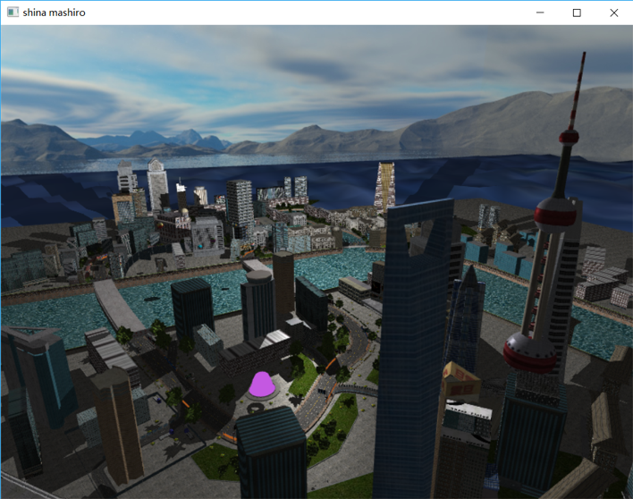
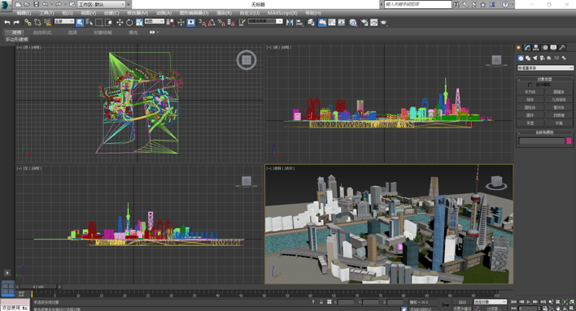
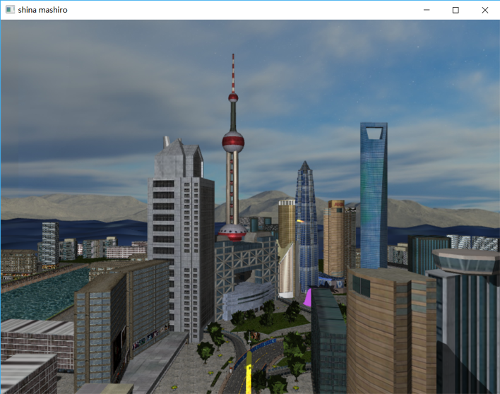
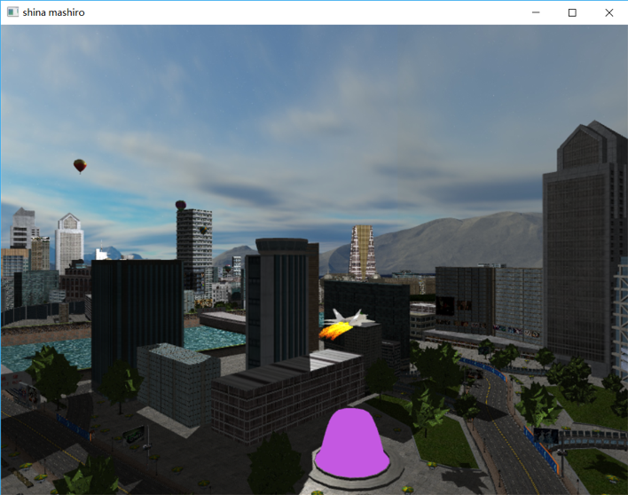
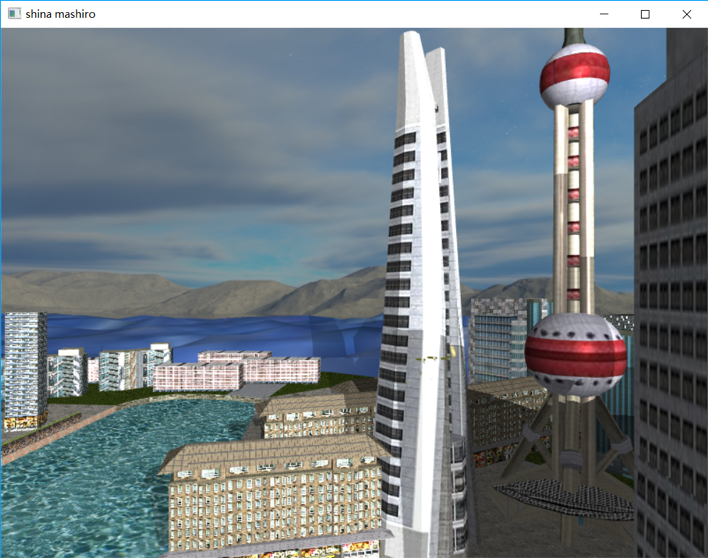
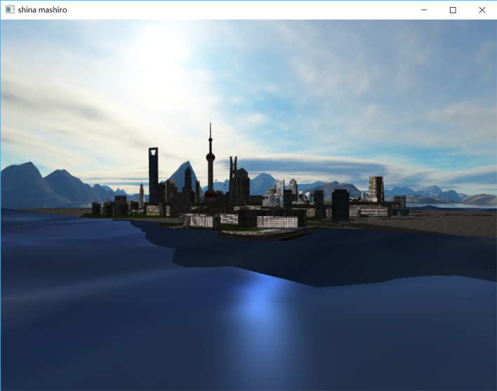
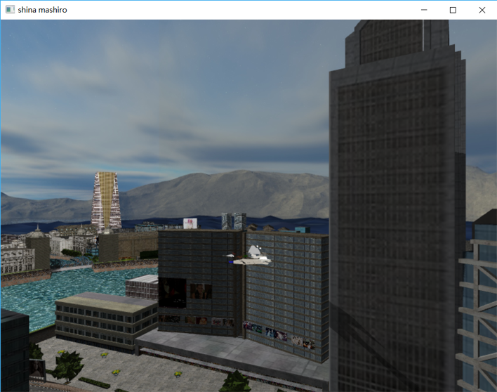
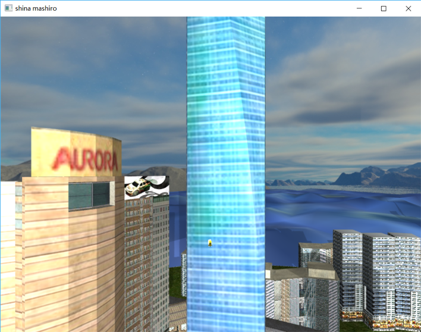
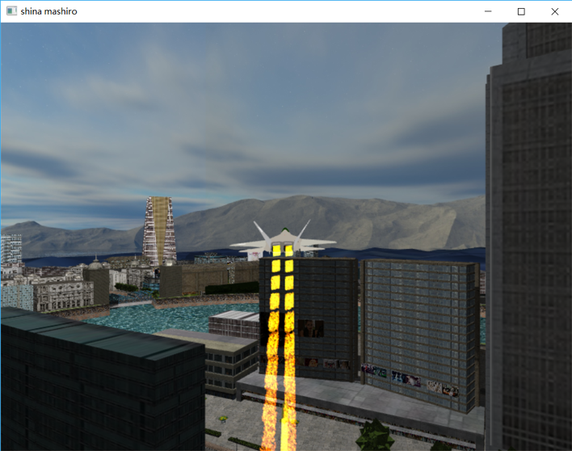

# CGProject

Project on Computer Graphics. Simulate aircraft flying in the city and projecting missiles for bombing. 

## Highlight

- Multi-Light Rendering
- Collision detection
  - OBB collision detection
  - Half-plane intersection
- Ocean Waves
- Particle System
  - Explosion
  - Fire

## Team Member

- Kai Shen
- Xuandong Zhao
- Xuwei Liu
- Mengze Li

## Results
- Overview of the project

- Dealing with obj in **3Dmax**

- First Perspective and Second Perspective

- Multi-Light

- Ocean Waves

- Explosion

- Fire

